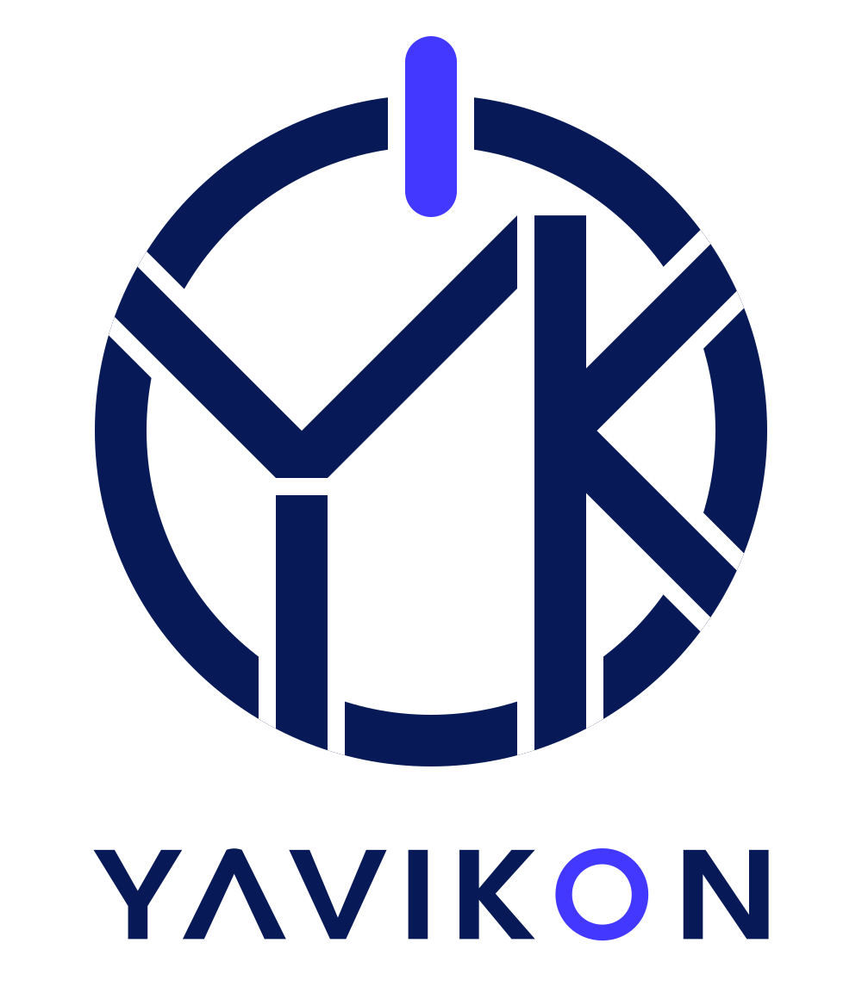

  

  Building thoughtful software products that turn complex workflows into clear, dependable experiences.

## Projects

### Yavikon Academy

A web and mobile platform for managing schools, tutors, students, schedules, attendance, lesson packages, and payments.

**Initial stack:** .NET · ASP.NET Core · Blazor · .NET MAUI
